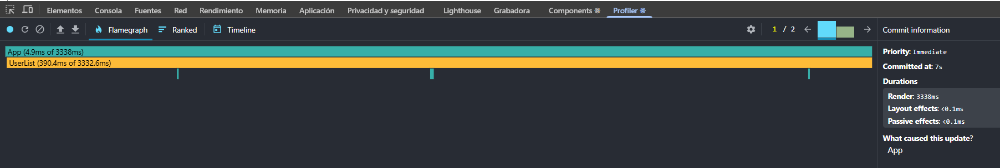

- La aplicación va muy lenta ¿Cuáles son sus puntos débiles?
Cada vez que el usuario escribe una letra en el buscador, se actualiza el estado search.
Esto provoca que el componente App se vuelva a renderizar completamente, junto con todos sus componentes hijos: SearchInput, UserList y todas las UserCard.

¿Ha mejorado la velocidad de la aplicación?

Sí, la velocidad de la aplicacion aumento, sigue siendo algo lento pero la mejora se nora a antes

¿Que cambias has hecho y por que? 

Se ha utilizado useMemo para evitar que el filtro de los 10.000 usuarios se ejecute en cada render, haciendo que solo se recalculen los resultados cuando cambia el texto de búsqueda. Esto reduce mucho el número de operaciones que se realizan en cada pulsación de tecla.

También se ha aplicado memo a los componentes SearchInput, UserList y UserCard para evitar que se rendericen de nuevo si sus props no cambian. Gracias a esto se eliminan muchos renders innecesarios y la aplicación funciona de forma mucho más fluida.