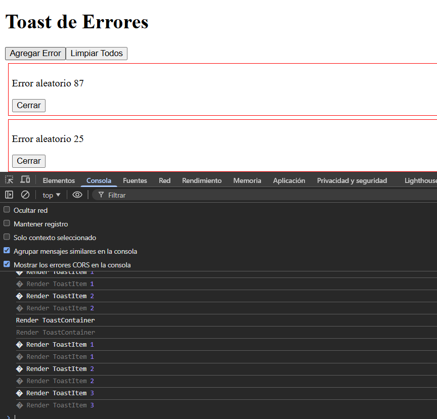
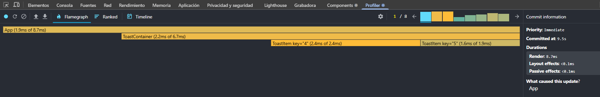
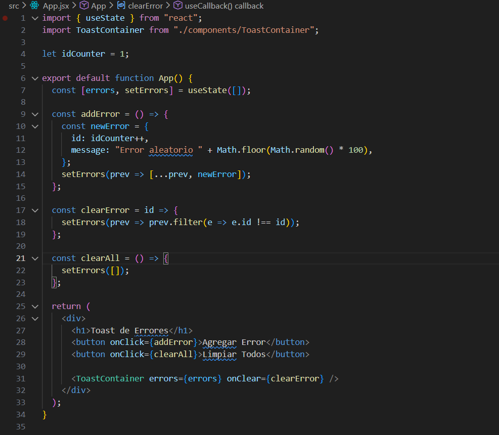
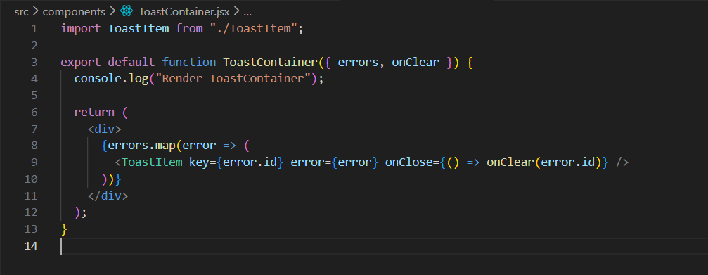
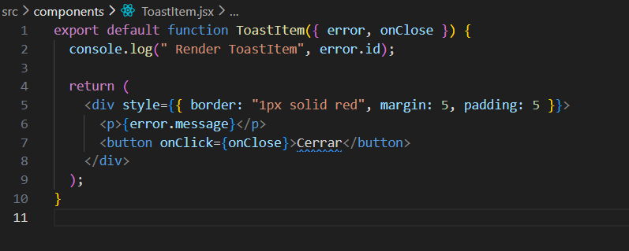

ANTES APP: 
ANTES ToastContainer 
Antes ToastItem: 

Por que: 
React.memo en ToastItem hace que solo se renderice si sus props cambian.
useCallback en App memoiza la función clearError, evitando que se cree una nueva función en cada render.
useCallback en ToastItem memoiza el handleClose, manteniendo la referencia estable para el botón.
Gracias a esto, solo se renderiza el toast que realmente se elimina, mejorando el rendimiento.